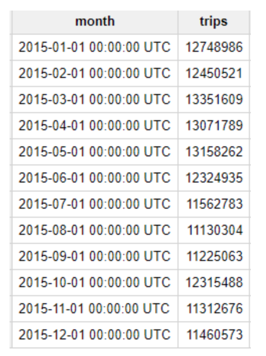
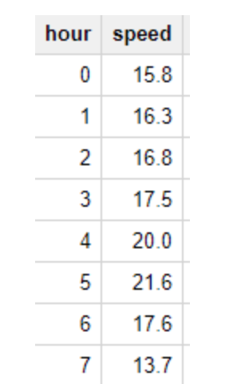
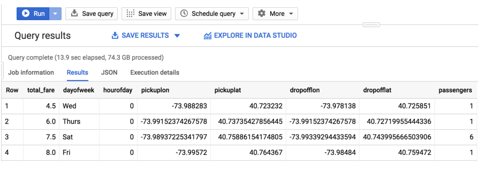
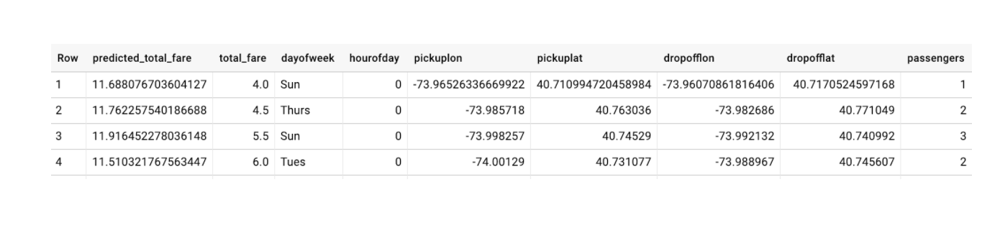

# Predict Taxi Fare with a BigQuery ML Forecasting Model

In this project, I explored millions of New York City yellow taxi cab trips using **yellow_trips_2015** dataset. I created a machine learning model inside of BigQuery to predict the fare of the cab ride given model inputs. Lastly, I evaluated the performance of model and make predictions with it.

## Objectives

In this project, I performed the following tasks:

 - Use BigQuery to import public datasets.
 - Query and explore the public taxi cab dataset.
 - Create a training and evaluation dataset to be used for batch prediction.
 - Create a forecasting model in **BQML**.
 - Evaluate the performance of your machine learning model.

### Task 1

In this task, log in with your google account and open https://console.cloud.google.com.

 - Create new project.
 - In the left side bar scroll to Big Data section and click on *Big Query*. This will open BigQuery webView UI for you.
 - Again select your project in left side bar.
 - Click on create new Dataset in the right bottom of BigQuery editor Section.
 - Import your dataset by uploading it or import it from any other external sources. 
 - I used **New York City** taxi public dataset in this project.

### Task 2
### Explore NYC taxi cab data.

## How many trips did Yellow taxis take each month in 2015?

### Query:
```
#standardSQL

SELECT
  TIMESTAMP_TRUNC ( pickup_datetime, MONTH ) AS month,
  COUNT(*) trips
FROM
  `bigquery-public-data.new_york.tlc_yellow_trips_2015`
GROUP BY 1
ORDER BY 1
```
### Result


### What was the average speed of Yellow taxi trips in 2015?

### Query:
```
#standardSQL

SELECT
  EXTRACT(HOUR FROM pickup_datetime) hour,
  ROUND(AVG(trip_distance / TIMESTAMP_DIFF( dropoff_datetime, pickup_datetime, SECOND))*3600, 1) speed
FROM
  `bigquery-public-data.new_york.tlc_yellow_trips_2015`
WHERE
  trip_distance > 0 
  AND fare_amount/trip_distance BETWEEN 2
  AND 10
  AND dropoff_datetime > pickup_datetime
GROUP BY 1
ORDER BY 1
```

### Result


During the day, the average speed is around 11-12 MPH; but at 5:00 AM the average speed almost doubles to 21 MPH. Intuitively this makes sense since there is likely less traffic on the road at 5:00 AM.


After exploring the dataset, Now we have to move to identify our objective.

### Identify our main objective

Our objective is to create a ML model in BigQuery to predict the price of a cab ride in New York City given the historical dataset of trips and trip data. *Predicting the fare before the ride could be very useful for trip planning for both the rider and the taxi agency.*


### Feature Selection.

```
#standardSQL
WITH params AS (
    SELECT
    1 AS TRAIN,
    2 AS EVAL
    ),
  daynames AS
    (SELECT ['Sun', 'Mon', 'Tues', 'Wed', 'Thurs', 'Fri', 'Sat'] AS daysofweek),
  taxitrips AS (
  SELECT
    (tolls_amount + fare_amount) AS total_fare,
    daysofweek[ORDINAL(EXTRACT(DAYOFWEEK FROM pickup_datetime))] AS dayofweek,
    EXTRACT(HOUR FROM pickup_datetime) AS hourofday,
    pickup_longitude AS pickuplon,
    pickup_latitude AS pickuplat,
    dropoff_longitude AS dropofflon,
    dropoff_latitude AS dropofflat,
    passenger_count AS passengers
  FROM
    `nyc-tlc.yellow.trips`, daynames, params
  WHERE
    trip_distance > 0 AND fare_amount > 0
    AND MOD(ABS(FARM_FINGERPRINT(CAST(pickup_datetime AS STRING))),1000) = params.TRAIN
  )
  SELECT * FROM taxitrips;

```
### Result



After feature selection the most important thing is which machine learning model we use to forecast fare of taxi trip.

### ML model creation in BigQuery

```
CREATE OR REPLACE MODEL
  taxi.taxifare_model OPTIONS (model_type='linear_reg', labels=['total_fare']) AS
WITH
  params AS (
  SELECT
    1 AS TRAIN,
    2 AS EVAL 
   ),
  daynames AS 
  	( SELECT ['Sun', 'Mon', 'Tues', 'Wed', 'Thurs', 'Fri', 'Sat'] AS daysofweek),
  taxitrips AS (
  SELECT
    (tolls_amount + fare_amount) AS total_fare,
    daysofweek[ ORDINAL(EXTRACT( DAYOFWEEK FROM pickup_datetime)) ] AS dayofweek,
    EXTRACT( HOUR FROM pickup_datetime) AS hourofday,
    pickup_longitude AS pickuplon,
    pickup_latitude AS pickuplat,
    dropoff_longitude AS dropofflon,
    dropoff_latitude AS dropofflat,
    passenger_count AS passengers
  FROM
    `nyc-tlc.yellow.trips`, daynames, params
  WHERE
    trip_distance > 0
    AND fare_amount > 0
    AND MOD(ABS(FARM_FINGERPRINT(CAST(pickup_datetime AS STRING))),1000) = params.TRAIN 
   ) 
   SELECT * FROM Taxitrips
```

### Evaluation of Model

```
#standardSQL
SELECT
  SQRT(mean_squared_error) AS rmse
FROM
  ML.EVALUATE(MODEL taxi.taxifare_model,(
    WITH
      params AS (
      SELECT
        1 AS TRAIN,
        2 AS EVAL ),
      daynames AS (
      SELECT ['Sun', 'Mon', 'Tues', 'Wed', 'Thurs', 'Fri', 'Sat'] AS daysofweek),
      taxitrips AS (
      SELECT
        (tolls_amount + fare_amount) AS total_fare,
        daysofweek [ ORDINAL(EXTRACT(DAYOFWEEK FROM pickup_datetime)) ] AS dayofweek,
        EXTRACT( HOUR FROM pickup_datetime) AS hourofday,
        pickup_longitude AS pickuplon,
        pickup_latitude AS pickuplat,
        dropoff_longitude AS dropofflon,
        dropoff_latitude AS dropofflat,
        passenger_count AS passengers
      FROM
        `nyc-tlc.yellow.trips`, daynames, params
      WHERE
        trip_distance > 0
        AND fare_amount > 0
        AND MOD(ABS(FARM_FINGERPRINT(CAST(pickup_datetime AS STRING))),1000) = params.EVAL 
        )
    	SELECT * FROM taxitrips 
  ))
```
As we see from the last output our model is trained and the root mean squared error is 9.4 . Now we have to start the Forecasting of trips fare.

### Forecasting fare of trips

``` 
#standardSQL
SELECT * FROM 
ml.PREDICT(MODEL `taxi.taxifare_model`, (
    WITH
      params AS (
      SELECT
        1 AS TRAIN,
        2 AS EVAL 
      ),
      daynames AS ( SELECT ['Sun', 'Mon', 'Tues', 'Wed', 'Thurs', 'Fri', 'Sat'] AS daysofweek),
      taxitrips AS (
      SELECT
        (tolls_amount + fare_amount) AS total_fare,
        daysofweek [ ORDINAL(EXTRACT(DAYOFWEEK FROM pickup_datetime))] AS dayofweek,
        EXTRACT( HOUR FROM pickup_datetime) AS hourofday,
        pickup_longitude AS pickuplon,
        pickup_latitude AS pickuplat,
        dropoff_longitude AS dropofflon,
        dropoff_latitude AS dropofflat,
        passenger_count AS passengers
      FROM
        `nyc-tlc.yellow.trips`, daynames, params
      WHERE
        trip_distance > 0
        AND fare_amount > 0
        AND MOD(ABS(FARM_FINGERPRINT(CAST(pickup_datetime AS STRING))),1000) = params.EVAL 
    )
    SELECT * FROM taxitrips 
    ));
```

## Output


## Conclusion:

We used BigQuery Machine Learning (BQML) and trained our model on New York taxi dataset to forecast the trips fare.

## Authors

* **Salman Ahmed** - *Initial work* - [SalmanAhmed](https://github.com/dev-salmanahmed)


See also the list of [contributors](https://github.com/your/project/contributors) who participated in this project.
